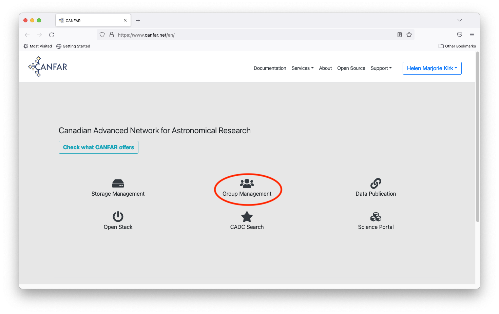
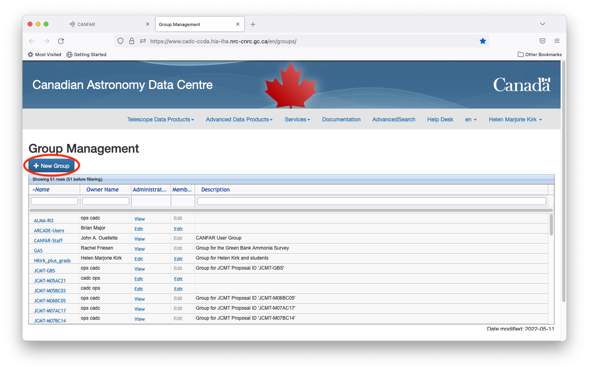
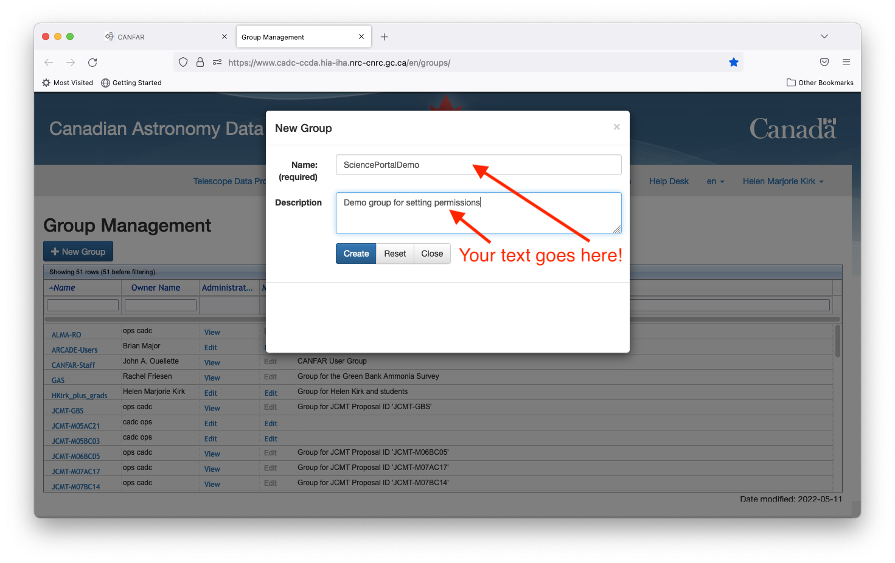
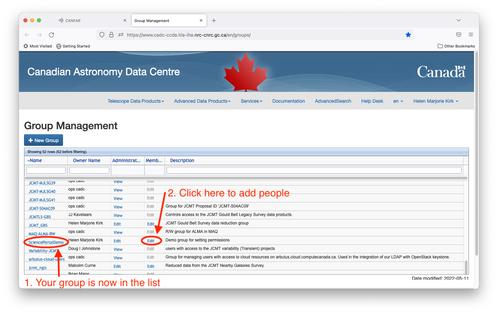
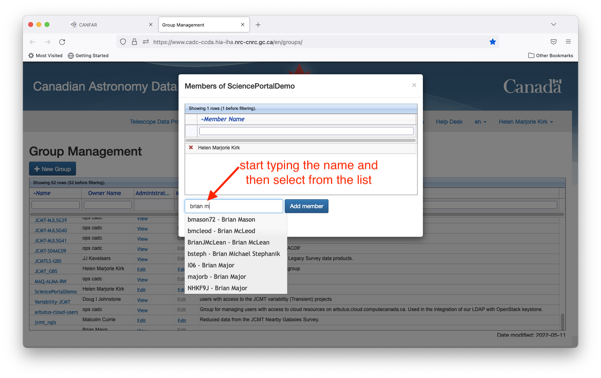
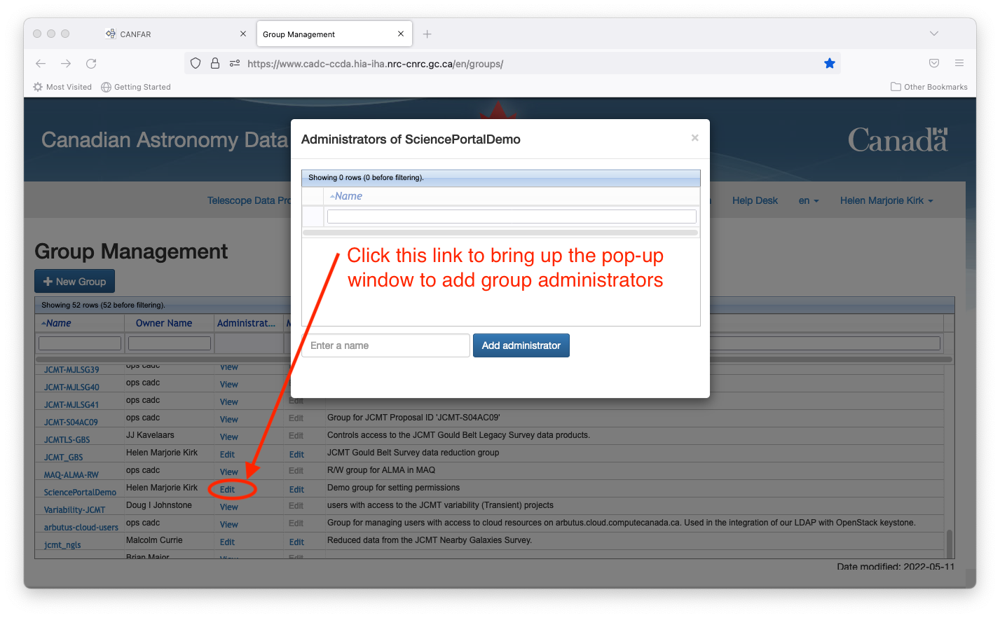
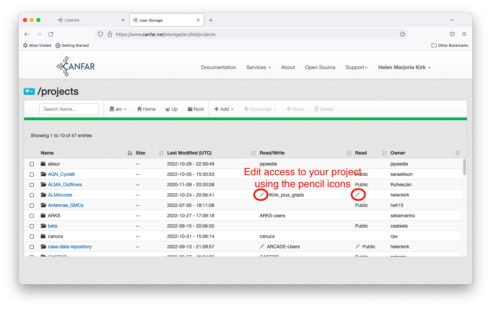
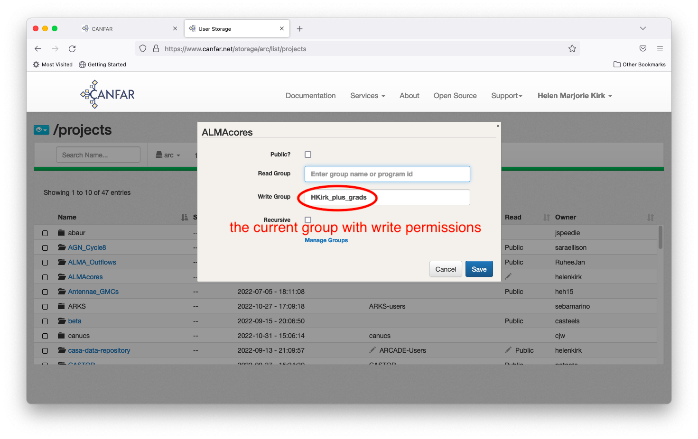
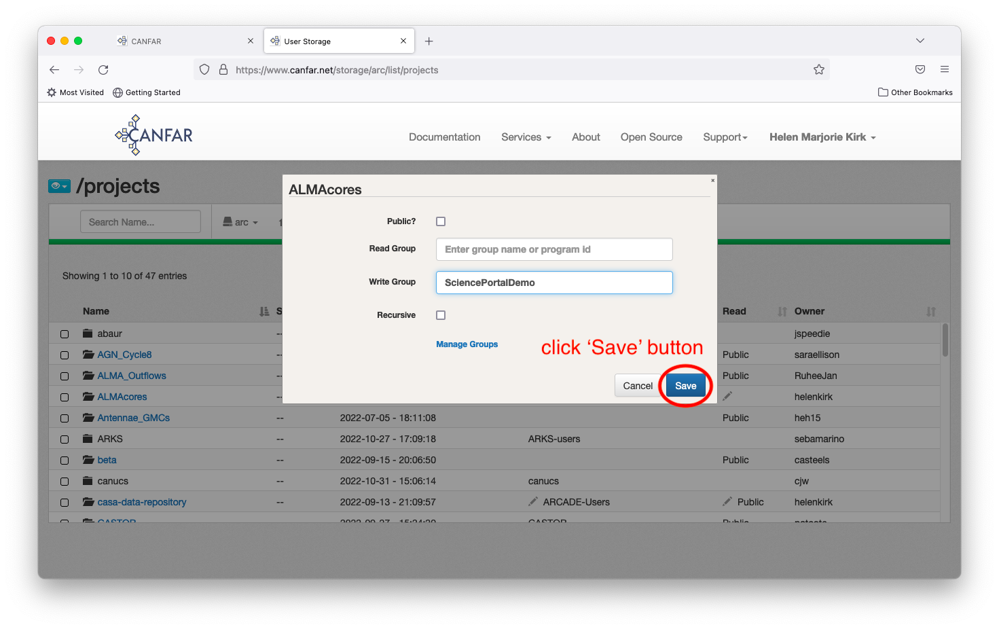
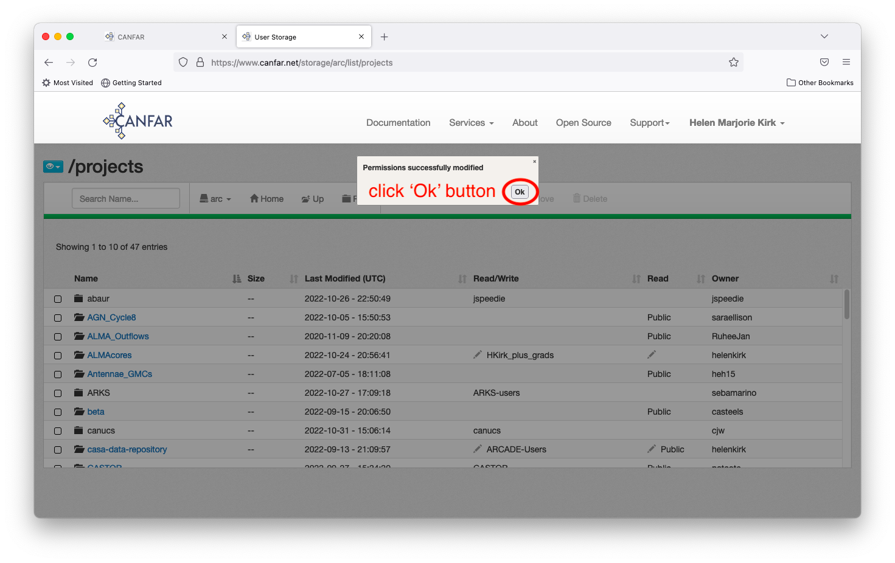

# Group Management Tools 

The group management tools allow you to define a set of people who have
permission to read, write, or execute your files.

Start by going to `canfar.net` and clicking on the Group Management
icon.

> 

You can then create a new `group` (list of CADC usernames) which you
will be granting access to your files. Click on the `New Group` button
to get started.

> 

A pop up window will appear that allows you to provide a group name and
brief description.

> 

This group will then appear on the master list on the main page. You can
add your collaborators by clicking the `Edit` button in the Membership
column.

> 

Start typing the name of your collaborator into the `Enter a name`
box, and a window will pop up with matches that you can use to find the
person. (NB: the search is based on the actual name and not CADC
username). Once you have selected the person, click the `Add member`
button. They will be added to the group even though the listing on the
pop-up window is not auto-refreshed. You can close the pop-up window and
click the `Edit` button a second time to confirm that they are now a
member of your group.

> 
>
> 

If you wish to grant others in the group permission to add further
members, etc, you can do so by clicking the `Edit` button in the
`Administrators` column and following the same procedure.

> 

With your group created, you navigate to CANFAR's webpage for all
projects, <https://www.canfar.net/storage/arc/list/projects> and edit
file access there. In this example, the project directory is
`ALMAcores`, and the group `HKirk_plus_grads` is already granted access
to read and write files.

> 

Click the pencil button to edit the group permissions. In this example,
the current group with write permissions appears in the associated box.

> 

Start typing in your desired group name, then select the group from the
pop-up list.

> 

Click the `Save` button

> 

then click `Ok` on the pop-up window.

> 

Your updated group permissions are now shown on the main page.

> 

Management of groups can also be done via the command line, and is the
prefered option for more complex settings. See [this
page](https://github.com/opencadc/science-platform/tree/master/doc#groups-and-permissions)
for instructions.
