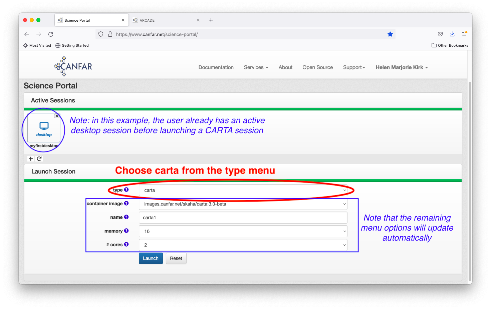
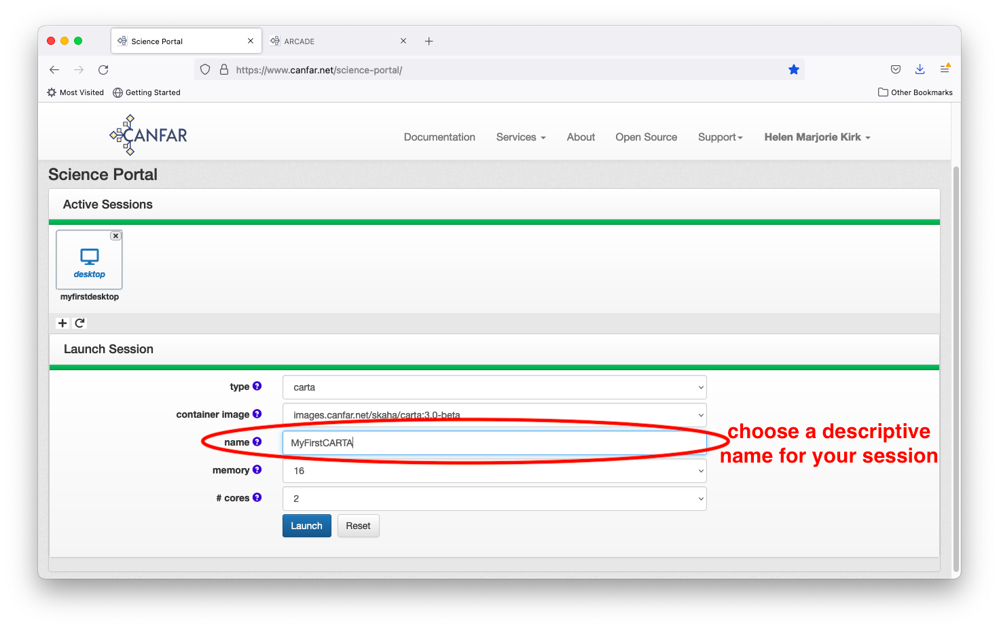
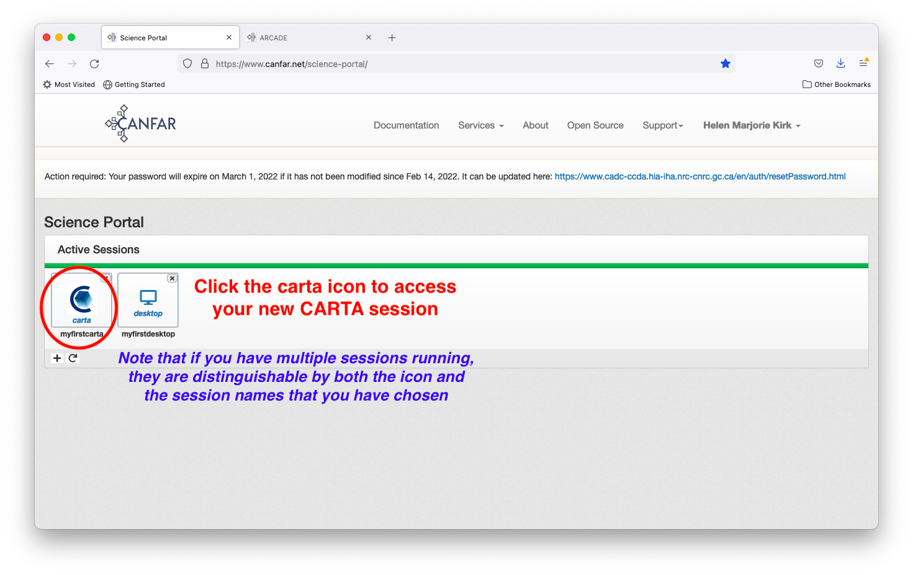
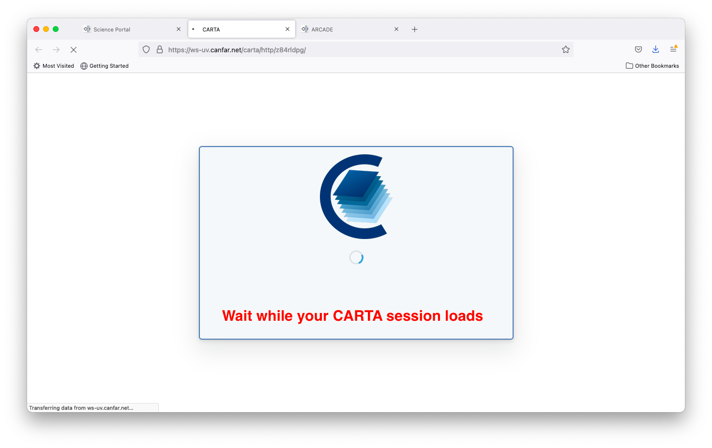

# Launching a CARTA session 

After logging in to the Science Portal and clicking the plus sign to
launch a new session, choose a session type of `carta`.

> 

Note that the remaining menu bars and options update automatically after
your session type selection. (Please be patient; sometimes it takes a
few seconds to update.) There are currently three options for
`container image`: choose the version of CARTA that you need here
(1.4, 2.0, or 3.0 beta).

> 

Give your session a descriptive name; this will later appear on your
Science Portal page if you need to log in again later.

> 

Next select the maximum amount of RAM that you anticipate requiring. It
is best to choose the smallest value that is reasonable for your needs,
as the computing resources are shared amongst all users. A very large
RAM request may slow or prevent you from launching a session if the
necessary resources are not currently available on the system. If you
are unsure of what you need, the default value of 16GB is a safe
assumption - it is the amount of RAM available on a MacBookPro.

> 

Similarly, select the maximum number of computing cores that you
anticipate requiring. As with the RAM, it is best to choose the smallest
number that you expect to need. If you are unsure of what you need, the
default value of 2 cores is likely sufficient. Most of the time, only
one core would be required.

> 

Now, hit the launch button and wait for your session to launch.

> 

Congratulations! You've started your first CARTA session. You are
automatically returned to the main Science Portal page, where your CARTA
session appears as an icon, with your chosen descriptive name. Access
the session by clicking on the session icon.

> 

Wait while the session loads, after which you arrive at the main landing
page.

> 
>
> 

Now, navigate through to the file that you would like to display on
CARTA. For information on how to upload files, see
(file transfers)[science-containers/general/General-tools/File_transfers] for the options available.
This tutorial assumes that you have a file uploaded already. First,
click the icon on the upper left to navigate up one directory.

> 

Files saved in your desktop session can be found in the
`home/[username]` or `home/[projectname]` directory. Click through the
directory structure until you reach your desired file. Select the file
and click the load button.

> 

Congratulations! You're displaying your first image in CARTA!

> 
