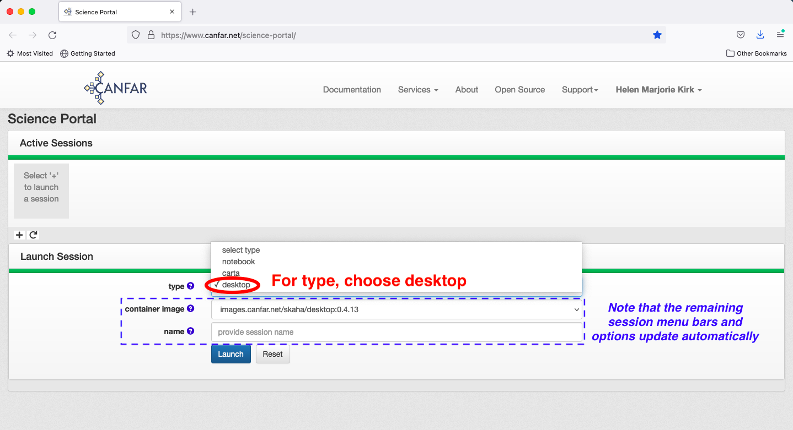

# Launching a Desktop session 

After logging in to the Science Portal and clicking the plus sign to
launch a new session, choose a session type of `desktop`

> 

Note that the remaining menu bars and options update automatically after
your session type selection. (Please be patient, sometimes this takes a
few seconds.) There is currently only one option for `container
image`, so no selection is needed.

> 

Give your session a descriptive name; this will later appear on your
Science Portal page if you need to log in again later

> 

Now, hit the launch button and wait for your session to launch

> 

Congratulations! You've started your first Desktop session. You are
automatically returned to the main Science Portal page, where your
desktop session appears as an icon, with your chosen descriptive name.
Access the session by clicking on the icon. Note that sometimes it takes
a few seconds for the link to your session to work properly; if you are
taken to a webpage that states `Bad gateway` when you click on the icon,
simply wait a few more seconds and then try again.

> 

This takes you to the landing page for your Desktop session. Click the
connect button to connect to the session. When you session becomes
inactive for some time, you are automatically returned to this page, but
you can return to the session exactly where you left off by once again
clicking the connect button.

> 
>
> 

As you can see, this desktop session has a similar look and feel to a
standard linux desktop that you may be familiar with. See the main page
for tutorials on using various aspects of the Desktop session, including
(launching a CASA-enabled terminal)[/science-containers/general/NewUser/LaunchDesktop].
