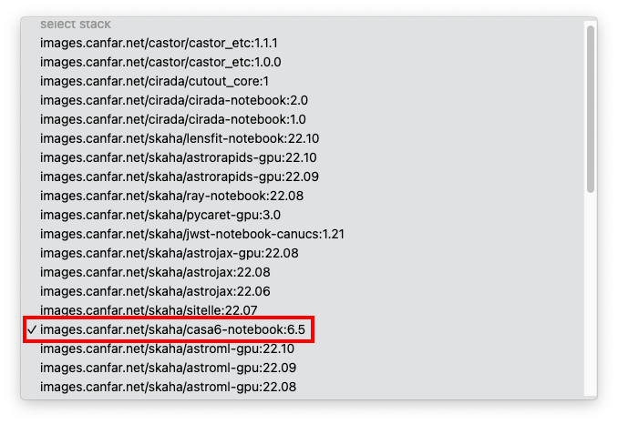
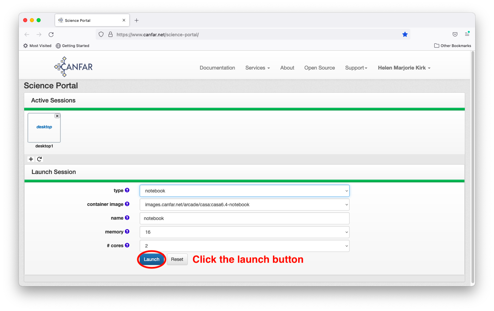
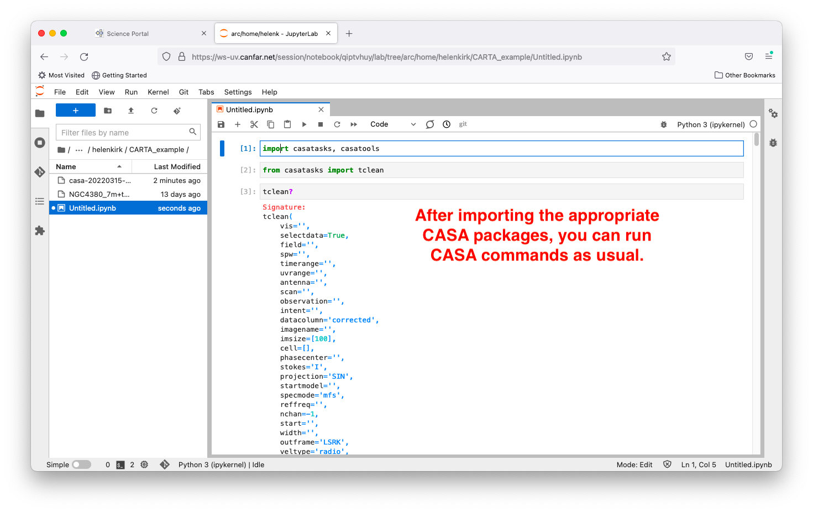

# Launching a Notebook session {#launch_notebook}

After logging in to the Science Portal and clicking the plus sign to
launch a new session, choose a session type of \'notebook\'.

> 
>
> 

Next, choose your prefered container image. The CASA6.5-notebook has
CASA version 6.5 already installed.

> 

Then add a descriptive name for your Notebook.

> 

Next select the maximum amount of RAM that you anticipate requiring. It
is best to choose the smallest value that is reasonable for your needs,
as the computing resources are shared amongst all users. A very large
RAM request may slow or prevent you from launching a session if the
necessary resources are not currently available on the system. If you
are unsure of what you need, the default value of 16GB is a safe
assumption - it is the amount of RAM available on a MacBookPro.

> 

Similarly, select the maximum number of computing cores that you
anticipate requiring. As with the RAM, it is best to choose the smallest
number that you expect to need. If you are unsure of what you need, the
default value of 2 cores is likely sufficient. Most of the time, only
one core would be required.

> 

Next, click the \'Launch\' button to start the Notebook session.

> 

Wait until a Notebook icon appears, then click on it to access your
session.

> 

Congratulations! You have now launched your first Notebook session.
There are a variety of different applications available for you to use.
In the Python 3 (ipykernel) Notebook icon in the top left, you can load
and run CASA commands, as illustrated in the last image below.

> 
>
> 
