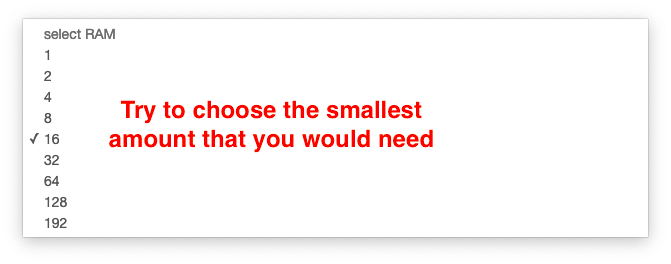
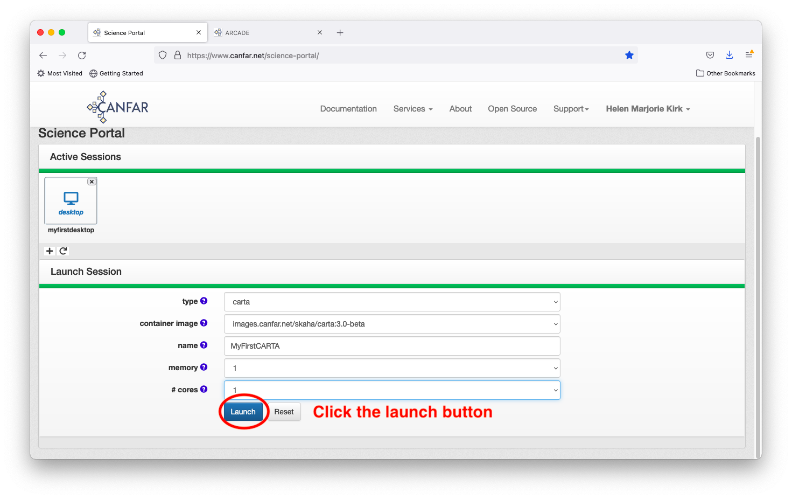
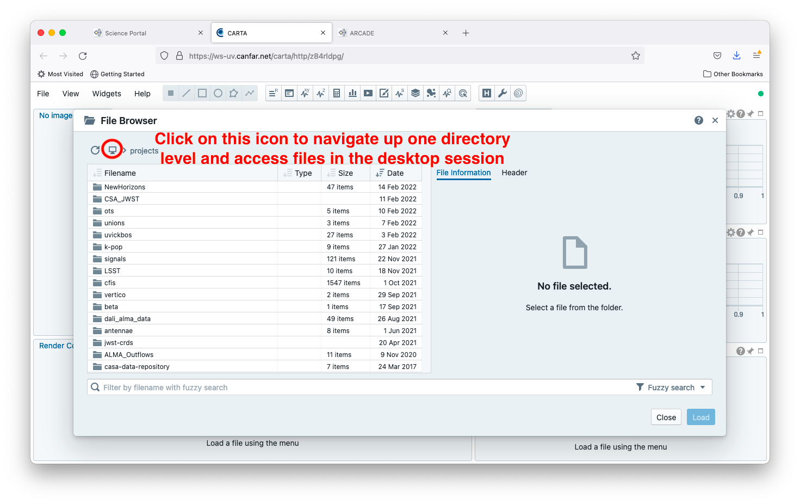
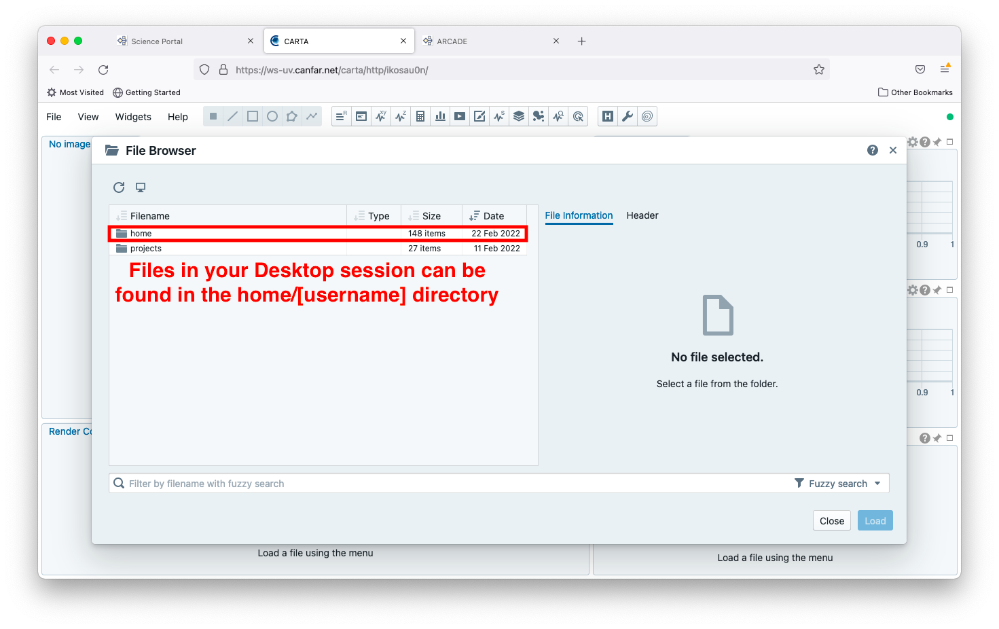
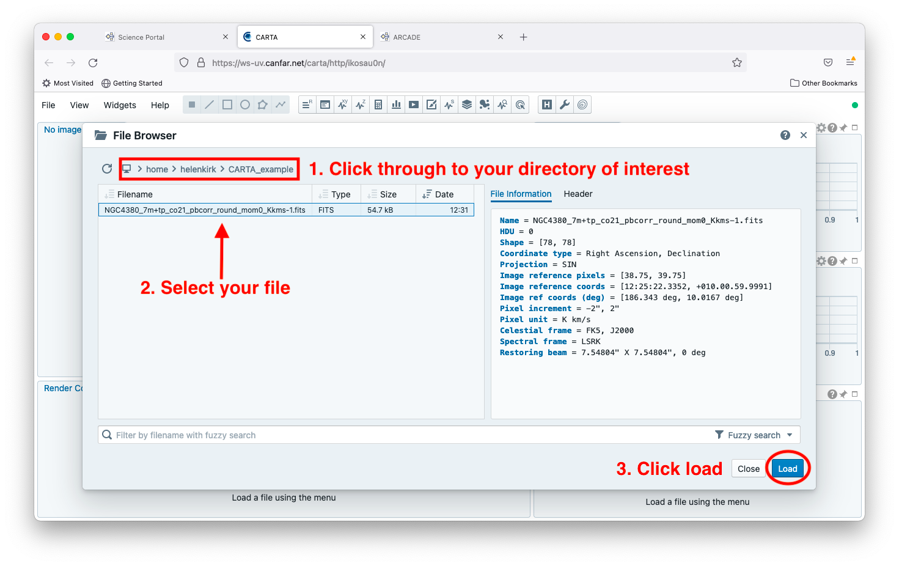
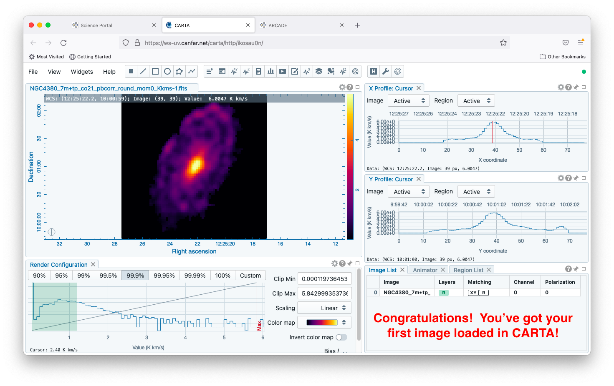

# Launching CARTA Sessions

CARTA (Cube Analysis and Rendering Tool for Astronomy) is a specialized image visualization and analysis tool designed for radio astronomy data. This guide walks you through launching and using CARTA sessions on the CANFAR Science Platform.

!!! abstract "🎯 What You'll Learn"
    - How to launch a CARTA session and choose the right version
    - How to size RAM/CPU for your datasets
    - How to load data from `/arc` and work with radio data cubes
    - Tips for analysis features, performance, and troubleshooting

## Overview

CARTA provides advanced features for:

- **Image visualization**: Multi-dimensional data cube exploration
- **Spectral analysis**: Line profiles and moment maps
- **Region analysis**: Statistical analysis of image regions
- **Animation**: Time-series and frequency animations
- **Collaboration**: Real-time session sharing

## Creating a CARTA Session

### Step 1: Select Session Type

From the Science Portal dashboard, click the **plus sign (+)** to create a new session, 
then select **carta** as your session type.

> 

### Step 2: Choose Container Version

Note that the menu options update automatically after your session type selection. 
Choose the CARTA version that meets your needs:

- **CARTA 4.0** (recommended): Latest features and bug fixes
(The screenshot is old and showed older versions only.)
> 

### Step 3: Configure Session

#### Session Name

Give your session a descriptive name that will help you identify it later 
(e.g., "m87-analysis", "ngc-1300-cube").

> 

#### Memory Configuration

Select the maximum amount of RAM for your analysis. Choose the smallest value 
reasonable for your needs, as resources are shared among all users:

- **8GB**: Small images and simple analysis
- **16GB (default)**: Most radio astronomy datasets
- **32GB+**: Large data cubes or complex multi-image analysis

!!! tip "Choosing Resources"
    Start with 8GB RAM and 2 CPU cores. Increase memory for very large FITS or CASA images and increase cores for CPU-intensive operations like moment map generation.

> 

#### CPU Cores

Select the number of computing cores. CARTA can benefit from multiple cores 
for certain operations:

- **1 core**: Basic image viewing
- **2 cores (default)**: Recommended for most tasks
- **4+ cores**: Large data processing and animations

> 

### Step 4: Launch Session

Click the **Launch** button and wait for your session to initialize.

> 

Your session will appear on the Science Portal dashboard with your chosen name. 
Click the CARTA icon to access your session.

> 

## Using CARTA

### Initial Setup

Wait for CARTA to load completely. You'll see the main CARTA interface:

> 
>
> 

### Loading Data

#### Navigate to Your Files

1. Click the folder icon in the upper left to navigate directories
2. Browse to your data location:
   - **Project data**: `/arc/projects/[group]/`
   - **Personal data**: `/arc/home/[username]/`

> 

#### Load an Image

1. Navigate through the directory structure to find your FITS file
2. Select the file you want to visualize
3. Click the **Load** button

> 

### Basic Operations

#### Image Display

Once loaded, your image appears in the main viewer with:

- **Zoom controls**: Mouse wheel or toolbar buttons
- **Pan**: Click and drag to move around the image
- **Colormap**: Adjust scaling and color scheme

> 

#### Data Cube Navigation

For 3D data cubes:

- **Channel slider**: Navigate through frequency/velocity channels
- **Animation controls**: Play through channels automatically
- **Spectral profile**: Click on pixels to see spectral information

#### Region Analysis

Create analysis regions:

1. Select region tools from the toolbar
2. Draw regions on your image
3. View statistics in the statistics panel
4. Export region data if needed

## Advanced Features

### Moment Maps

Create moment maps from data cubes:

1. Load your data cube
2. Go to File → Generate Moment Map
3. Select moment type (0, 1, or 2)
4. Set channel range
5. Generate and display

### Spectral Line Analysis

Analyze spectral profiles:

1. Click on any pixel to see the spectrum
2. Use the spectral profiler for detailed analysis
3. Fit Gaussian profiles to lines
4. Measure line properties

### Contour Overlays

Add contour overlays:

1. Load a second image
2. Go to View → Contours
3. Adjust contour levels and styling
4. Overlay on your main image

## Session Sharing

### Real-time Collaboration

Share your CARTA session with collaborators:

1. Click the session menu
2. Select "Share Session"
3. Add collaborator usernames
4. Set permissions (view-only or full control)

### Export and Save

Save your work:

- **Export images**: File → Export Image (PNG, JPEG, PDF)
- **Save regions**: File → Export Regions (DS9, CRTF formats)
- **Save session**: File → Save Layout (restore later)

## Data Format Support

CARTA supports multiple astronomical image formats:

- **FITS**: Standard astronomical format
- **CASA images**: Radio astronomy standard
- **HDF5**: Large dataset format
- **MIRIAD**: Legacy radio format

## Performance Tips

### Optimization

- **Close unused images**: Reduces memory usage
- **Use appropriate data types**: Float32 vs Float64
- **Enable GPU acceleration**: For supported operations
- **Adjust cache settings**: Balance memory vs speed

!!! warning "Large Data Cubes"
    Very large cubes can consume significant memory. Load subregions, work with decimated data, or increase RAM to avoid crashes.

### Large Dataset Handling

For very large files:

- **Use decimation**: View subsampled versions first
- **Load subregions**: Focus on areas of interest
- **Consider preprocessing**: Use CASA to create smaller working files

## Troubleshooting

### Common Issues

**CARTA won't load**
- Check browser compatibility (Chrome/Firefox recommended)
- Disable browser extensions that might interfere
- Clear browser cache and cookies

**Performance problems**
- Reduce image size or resolution
- Close other applications
- Check available memory

**File loading errors**
- Verify file format compatibility
- Check file permissions in storage
- Ensure file isn't corrupted

**Display issues**
- Try different colormaps
- Adjust image scaling
- Check graphics driver compatibility

### Getting Help

- **CARTA Documentation**: [carta.casa.nrao.edu](https://carta.casa.nrao.edu)
- **Support**: Email [support@canfar.net](mailto:support@canfar.net)
- **Community**: Join our Discord for CARTA tips and tricks

## Best Practices

### Workflow Organization

- **Organize data**: Keep raw and processed data separate
- **Document analysis**: Save session layouts for reproducibility
- **Version control**: Track analysis parameters and results

### Resource Management

- **Monitor usage**: Check memory consumption during analysis
- **Clean up**: Close sessions when finished
- **Share efficiently**: Use view-only sharing when appropriate

## Next Steps

- **[Radio Astronomy Workflows](../radio-astronomy/index.md)**: CARTA in radio astronomy pipelines
- **[Batch Processing](../../batch-jobs.md)**: Automate CARTA operations
- **[CASA Integration](../radio-astronomy/casa-workflows.md)**: Combine CARTA with CASA analysis
- **[Desktop Sessions](launch-desktop.md)**: Full desktop environment with CARTA
