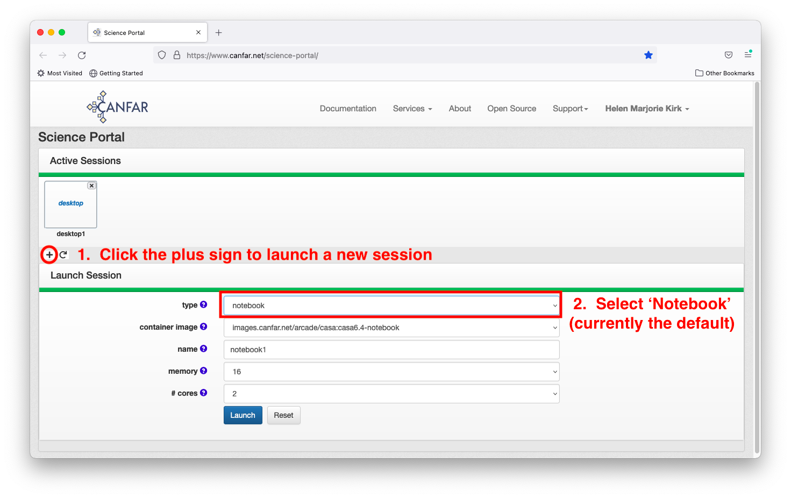

# Launching Jupyter Notebook Sessions

**Interactive Jupyter Lab sessions provide a powerful environment for data analysis, visualisation, and computational astronomy. This guide walks you through launching and using notebook sessions on the CANFAR Science Platform.**

!!! abstract "🎯 What You'll Learn"
    - Launching a Jupyter notebook session on CANFAR
    - Choosing the right container and resources
    - How storage works inside notebooks and what persists
    - Tips for performance, collaboration, and troubleshooting

## Overview


Jupyter notebooks combine code execution, rich text documentation, and inline visualisations in a single interface. CANFAR's notebook sessions include:

- **Jupyter Lab**: Full-featured development environment
- **Pre-configured containers**: Astronomy-specific software stacks
- **Persistent storage**: Access to your ARC and VOSpace data
- **Collaborative sharing**: Share sessions with team members

## Creating a New Session

### Step 1: Access Session Creation

From the Science Portal dashboard, click the **plus sign (+)** to create a new session, 
then select **notebook** as your session type.

> 
>
> 

### Step 2: Choose Your Container

Select a container image that includes the software you need. Each container comes pre-configured
with specific tools and libraries:

- **astroml** (recommended): Modern Python astronomy libraries (AstroPy, NumPy, SciPy, Matplotlib)
- **CASA 6.5-notebook**: Includes CASA (Common Astronomy Software Applications) for radio astronomy
- **General purpose**: Standard Python data science stack

> 

!!! tip "Container Selection"
    Start with **astroml** for most astronomy workflows. It includes the latest astronomy libraries and is actively maintained. Use CASA containers only when you specifically need CASA functionality.

### Step 3: Configure Session Resources

#### Session Name

Choose a descriptive name that helps you identify this session later (e.g., `galaxy-photometry`, `pulsar-analysis`).

> 

#### Resource Allocation

> 

Most astronomy software uses only one core unless specifically configured for parallel processing.

> 

See [resource allocation guidelines](../../concepts.md#session-resource-allocation) for more information.

!!! tip "Resource Strategy"
    **Start with flexible mode** for most notebook work. Only use fixed mode when you need guaranteed performance or have specific resource requirements determined through testing.

### Step 4: Launch Your Session

Click the **Launch** button to create your Notebook session. The system will:

1. Allocate computing resources
2. Pull the container image (if not cached)
3. Initialize your environment
4. Start Jupyter Lab

!!! info "First Launch Timing"
    The first launch of a specific container may take 2-3 minutes while the image is downloaded and cached. Subsequent launches are typically 30-60 seconds.

> 

### Step 5: Connect to Your Session

Wait for the Notebook icon to appear on your dashboard, then click it to access your session.
**Initial startup may take 2-3 minutes** if the container hasn't been used recently on this server.

> 

## Working in Jupyter Lab

### Available Interfaces

- **Python 3 (ipykernel)**: Standard Python with astronomy libraries
- **Terminal**: Command-line access for advanced operations
- **File Browser**: Navigate your `/arc` storage directories

> 

### Storage Access

Your notebook session automatically mounts:

- **`/arc/projects/[groupname]/`**: Shared project storage
- **`/arc/home/[username]/`**: Personal storage
- **`/tmp/`**: Temporary space (cleared when session ends)

!!! warning "Save to Persistent Storage"
    Files in `/tmp/` do not persist when the session ends. Save important work to `/arc/projects/` or `/arc/home/`. For heavy I/O, use `/scratch/` if available and copy results to `/arc` when done.

### Example: Astronomy Analysis

Here's a simple example using AstroPy to work with FITS data:

```python
import numpy as np
import matplotlib.pyplot as plt
from astropy.io import fits
from astropy.wcs import WCS

# Load a FITS file
hdul = fits.open("/arc/projects/[groupname]/data/image.fits")
data = hdul[0].data
header = hdul[0].header

# Display the image
plt.figure(figsize=(10, 8))
plt.imshow(data, origin="lower", cmap="viridis")
plt.colorbar(label="Flux")
plt.title("Astronomical Image")
plt.show()
```

### Using CASA in Jupyter

If you're using a CASA container, you can run CASA commands directly in Python notebooks:

> 

```python
# CASA example
import casa_tools as tools
import casa_tasks as tasks

# Create measurement set summary
tasks.listobs(vis="/arc/projects/[groupname]/data/observation.ms")

# Image the data
tasks.tclean(
    vis="/arc/projects/[groupname]/data/observation.ms",
    imagename="my_image",
    imsize=1024,
    cell="0.1arcsec",
)
```

## Session Management

### Saving Your Work

- **Auto-save**: Notebooks auto-save every 2 minutes
- **Manual save**: Use Ctrl+S or File → Save
- **Version control**: Consider using Git for code versioning

### Ending Sessions

Always properly shut down your session to free resources:

1. Save all work
2. Close Jupyter Lab tab
3. Return to Science Portal
4. Click the session icon and select "Delete"

## Best Practices

### Resource Usage

- **Start small**: Begin with minimal resources and scale up if needed
- **Monitor usage**: Use the terminal to check memory with `htop` or `free -h`
- **Clean up**: Remove large temporary files when finished

### Data Management

- **Organize files**: Create clear directory structures in your `/arc` space
- **Document work**: Use markdown cells to explain your analysis
- **Backup results**: Important results should be saved to persistent storage

### Collaboration

- **Share sessions**: Real-time collaboration for debugging and teaching
- **Version control**: Use Git for code sharing and version management
- **Documentation**: Well-documented notebooks help collaborators understand your work

## Troubleshooting

### Common Issues

### Session won't start

- Check resource availability
- Try reducing memory/CPU requirements
- Contact support if persistent

### Can't access files

- Verify file paths in `/arc/projects/[groupname]/`
- Check group permissions
- Ensure files were uploaded correctly

### Notebook kernel crashes

- Often due to memory overuse
- Restart kernel and reduce data size
- Consider using more memory

### Performance issues

- Check if other users are sharing resources
- Use `htop` to monitor system usage
- Consider running during off-peak hours
