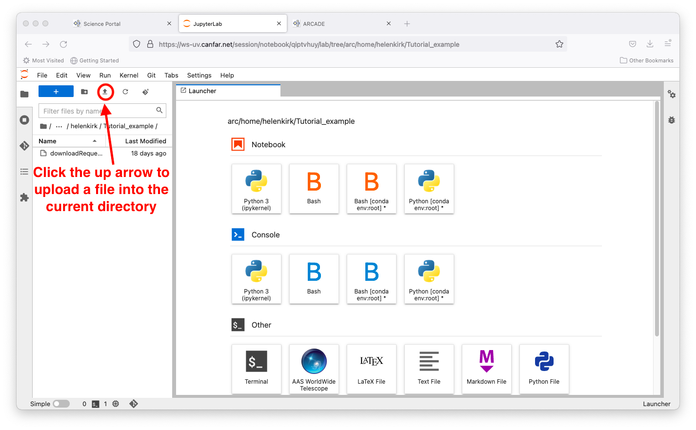
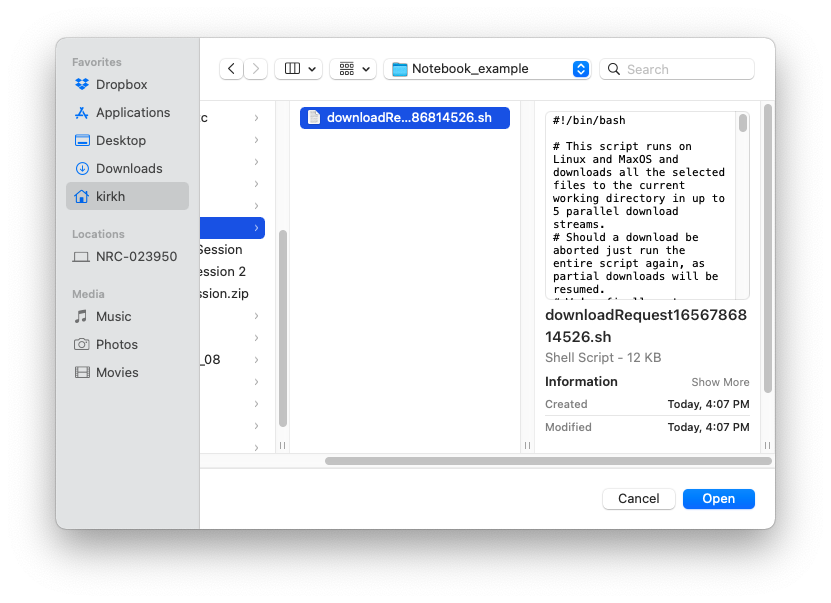
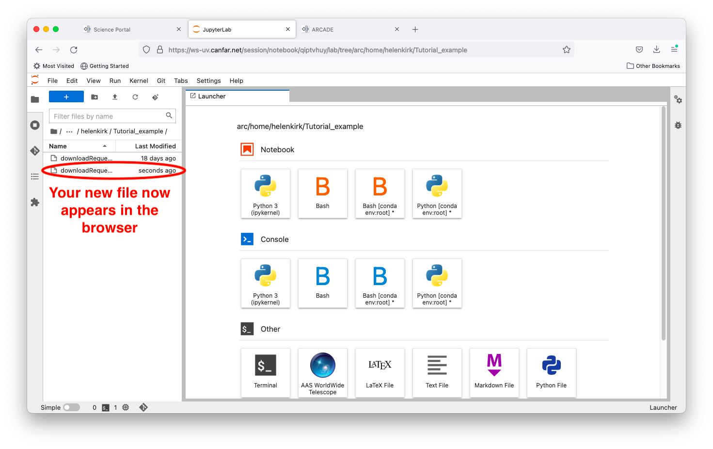
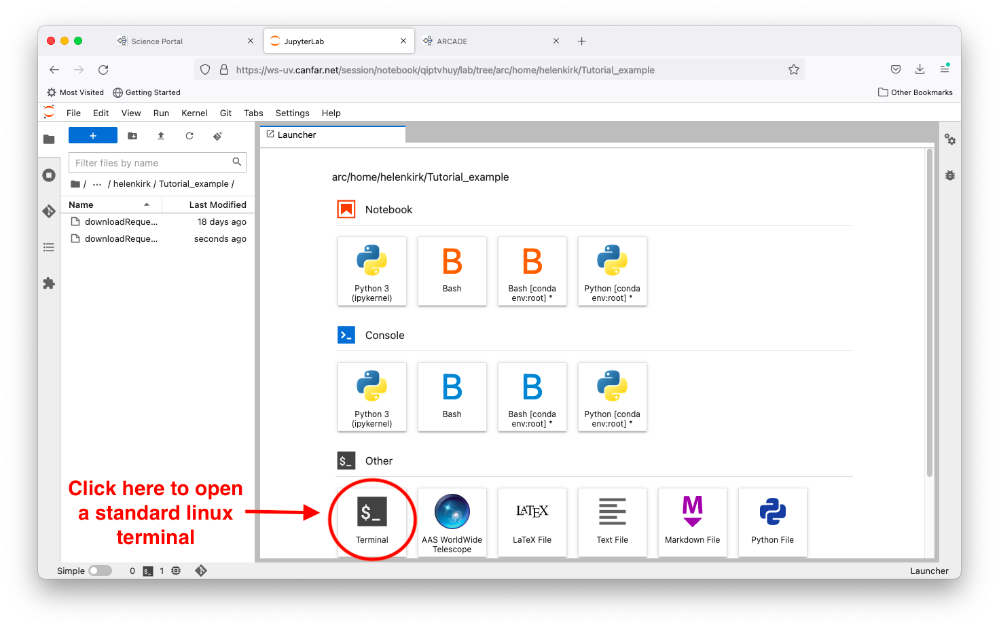
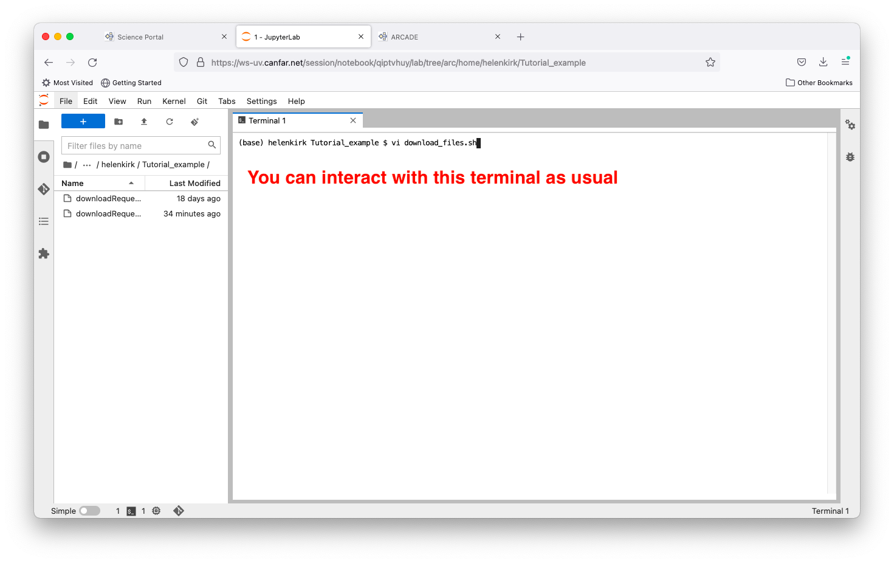
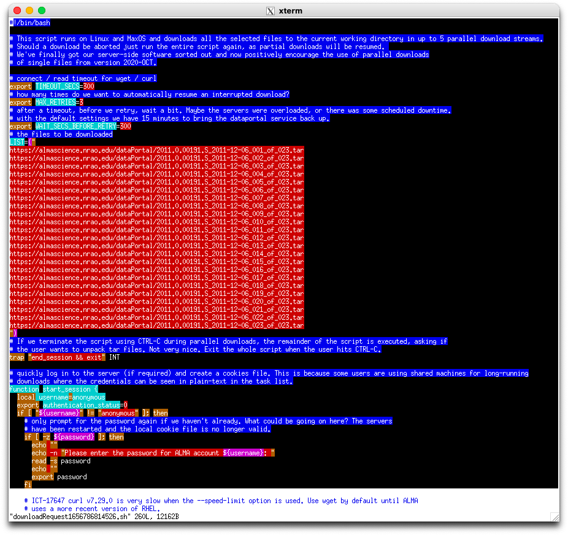
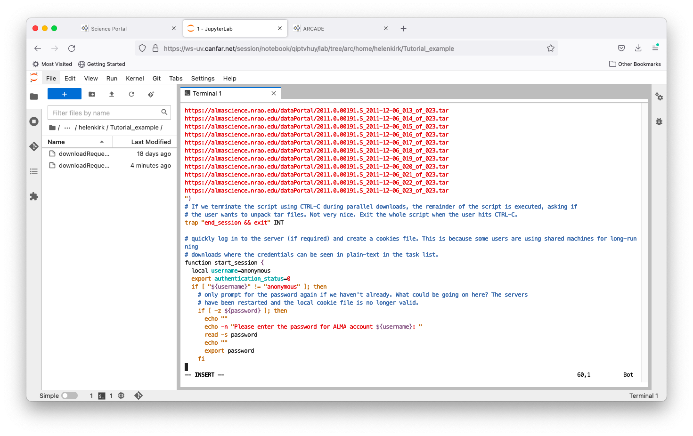

# Notebook Sessions

**Interactive Jupyter Lab sessions for data analysis and computational astronomy**

!!! abstract "🎯 What You'll Learn"
    - How to launch and configure Jupyter notebook sessions
    - Available containers and when to use each
    - File management, uploads, and storage integration
    - Performance tips, collaboration, and troubleshooting

Jupyter notebooks combine code execution, rich text documentation, and inline visualisations in a single interface. CANFAR's notebook sessions include pre-configured astronomy software stacks, persistent storage access, and collaborative sharing capabilities.

## 📋 Overview

Notebook sessions provide:

- **Jupyter Lab:** Full-featured development environment with file browser, terminal, and extensions
- **Pre-configured containers:** Astronomy-specific software stacks with popular libraries
- **Persistent storage:** Direct access to your `/arc/home/` and `/arc/projects/` data
- **Collaborative sharing:** Share session URLs with team members
- **Terminal access:** Built-in terminal for command-line operations
- **File transfers:** Upload/download capabilities for data management

## 🚀 Creating a Notebook Session

### Step 1: Access Session Creation

From the Science Portal dashboard, click the **plus sign (+)** to create a new session, then select **notebook** as your session type.


### Step 2: Choose Your Container

Select a container image that includes the software you need. Each container comes pre-configured with specific tools and libraries:


#### Available Containers

| Container | Contents | Best For |
|-----------|----------|----------|
| **astroml** ⭐ | Modern Python astronomy stack (AstroPy, NumPy, SciPy, Matplotlib, Pandas) | General astronomy analysis, data science |
| **CASA 6.5-notebook** | CASA (Common Astronomy Software Applications) + Python stack | Radio astronomy data reduction |
| **General purpose** | Standard Python data science stack | Basic Python development |

!!! tip "Container Selection"
    Start with **astroml** for most astronomy workflows. It includes the latest astronomy libraries and is actively maintained. Use CASA containers only when you specifically need CASA functionality.

### Step 3: Configure Session Resources

#### Session Name

Choose a descriptive name that helps you identify this session later:


**Good session names:**
- `galaxy-photometry`
- `pulsar-analysis`
- `alma-data-reduction`
- `exoplanet-search`

#### Memory Allocation

Select the maximum amount of RAM you anticipate requiring:


**Memory Guidelines:**
- **4GB:** Basic analysis, small datasets
- **16GB:** Standard workflows, moderate datasets (recommended default)
- **32GB:** Large datasets, memory-intensive operations
- **64GB+:** Very large datasets, specialized workflows

!!! warning "Resource Sharing"
    Choose the smallest value reasonable for your needs. Computing resources are shared amongst all users. Excessive requests may slow or prevent session launch.

#### CPU Cores

Select the maximum number of computing cores you anticipate requiring:


**CPU Guidelines:**
- **1-2 cores:** Most single-threaded analysis (recommended default)
- **4-8 cores:** Parallel processing, multi-threaded libraries
- **16+ cores:** Highly parallel workflows

### Step 4: Launch Session

Click the **Launch** button to start your notebook session:


Wait until a notebook icon appears on your dashboard, then click it to access your session:


## 🧭 Using Jupyter Lab

### Interface Overview

Once connected, you'll see the Jupyter Lab interface with several key areas:

- **File Browser (left):** Navigate your filesystem and open files
- **Main Work Area (centre):** Notebooks, terminals, and file editors
- **Launcher:** Create new notebooks, terminals, and files
- **Menu Bar:** File operations, edit functions, and view options

### Starting Your First Notebook

1. **Click** the Python 3 (ipykernel) notebook icon in the launcher
2. **Start coding** in the first cell
3. **Run cells** with `Shift+Enter`

### File Management

#### Persistent Storage Locations

Your notebook session has access to:

```bash
/arc/home/[user]/           # Your personal 10GB space
/arc/projects/[project]/    # Shared project spaces
/scratch/                   # Temporary high-speed storage
```

#### Uploading Files

**Method 1: Direct Upload (< 100MB)**

1. **Navigate** to your target directory in the file browser
2. **Click** the upload arrow in the top menu bar



3. **Select files** and click "Open"



4. **Files appear** in the browser



**Method 2: Copy-Paste Text**

For code snippets or small text files:

1. **Open a terminal** by double-clicking the terminal icon



2. **Create/edit files** using command-line editors



3. **Copy text** from your local computer



4. **Paste into the editor**



### Working with CASA

If using a CASA container, you can run CASA commands directly in notebook cells:

```python
# Import CASA tasks
import casatasks as casa

# Example: Import UV data
casa.importuvfits(fitsfile='data.uvfits', vis='data.ms')

# List measurement set contents
casa.listobs(vis='data.ms')
```

## 🔧 Advanced Features

### Terminal Access

Access the built-in terminal for command-line operations:

1. **Click** the terminal icon in the launcher
2. **Run commands** as you would in any Linux terminal
3. **Install packages** with pip or conda (where permissions allow)

```bash
# Example terminal commands
ls /arc/projects/[project]/
python script.py
git clone https://github.com/username/repo.git
```

### Jupyter Extensions

Many useful extensions are pre-installed:

- **Variable Inspector:** View variable contents
- **Table of Contents:** Navigate large notebooks
- **Git Integration:** Version control directly in Jupyter

### Python Package Management

#### Pre-installed Packages

Most astronomy packages are already available:

```python
import numpy as np
import matplotlib.pyplot as plt
import astropy
from astropy.io import fits
import pandas as pd
import scipy
```

#### Installing Additional Packages

```bash
# Install packages for current session (may require --user option)
# Will install in home directory
pip install package-name

# Check installed packages
pip list
```

## 🤝 Collaboration and Sharing

### Sharing Sessions

Share your notebook session with team members:

1. **Copy the session URL** from your browser address bar
2. **Share with colleagues** who have CANFAR accounts
3. **Coordinate editing** to avoid conflicts

### Best Practices for Collaboration

- **Use descriptive cell comments** for clarity
- **Save frequently** to persistent storage
- **Use version control** (git) for important work
- **Communicate** who's editing what sections

### Sharing Notebooks

```bash
# Save notebook to shared location
cp my-analysis.ipynb /arc/projects/[project]/notebooks/

# Share via git repository
git add my-analysis.ipynb
git commit -m "Add analysis notebook"
git push origin main
```

## ⚡ Performance Optimisation

### Memory Management

```python
# Monitor memory usage
import psutil
print(f"Memory usage: {psutil.virtual_memory().percent}%")

# Free up memory by deleting large variables
del large_array
import gc
gc.collect()
```

### Storage Performance

```python
# Use /scratch for intensive I/O operations
import shutil

# Copy to scratch for processing
shutil.copy('/arc/projects/[project]/large_file.fits', '/scratch/')

# Process in scratch
# ... your analysis code ...

# Copy results back
shutil.copy('/scratch/results.fits', '/arc/projects/[project]/outputs/')
```

### Efficient Data Loading

```python
# For large FITS files, load only needed sections
from astropy.io import fits

# Load header only
header = fits.getheader('large_file.fits')

# Load specific HDU
data = fits.getdata('large_file.fits', ext=1)

# Use memmap for very large files
data = fits.getdata('huge_file.fits', memmap=True)
```

## 🔧 Troubleshooting

### Common Issues

#### Kernel Not Starting

**Problem:** Python kernel fails to start

**Solutions:**
1. Restart the kernel: `Kernel` → `Restart Kernel`
2. Clear output: `Cell` → `All Output` → `Clear`
3. Check memory usage and restart session if needed

#### Out of Memory Errors

**Problem:** `MemoryError` or kernel crashes

**Solutions:**
1. Restart kernel and clear variables
2. Process data in smaller chunks
3. Use more memory-efficient data types
4. Launch session with more RAM

#### Slow Performance

**Problem:** Notebooks running slowly

**Solutions:**
1. Check system resources with `htop` in terminal
2. Close unused notebooks and terminals
3. Clear notebook output: `Cell` → `All Output` → `Clear`
4. Use `/scratch` for temporary files

#### File Upload Issues

**Problem:** Cannot upload files or uploads fail

**Solutions:**
1. Check file size (< 100MB for web upload)
2. Use command-line tools for larger files
3. Check available disk space
4. Try uploading to `/scratch` first, then moving

### Getting Help

```python
# Built-in help systems
help(function_name)
?function_name          # In JupyterLab
??function_name         # Show source code

# Package documentation
import astropy
astropy.__version__
```

## 📚 Learning Resources

### Jupyter Lab Documentation

- **[JupyterLab User Guide](https://jupyterlab.readthedocs.io/)**
- **[Jupyter Notebook Basics](https://jupyter-notebook.readthedocs.io/)**
- **[IPython Magic Commands](https://ipython.readthedocs.io/en/stable/interactive/magics.html)**

## 🔗 Next Steps

- **[Try Desktop Sessions](desktop.md)** for GUI applications
- **[Explore CARTA](carta.md)** for radio astronomy visualisation
- **[Use Firefly](firefly.md)** for optical survey data
- **[Learn about Storage](../storage/)** for data management
- **[Batch Processing](batch.md)** for large-scale automation

## 🆘 Getting Help

- **In-session help:** Use `help()` and `?` in notebooks
- **Documentation:** Browse [CANFAR docs](../)
- **[Support](../support)`**
